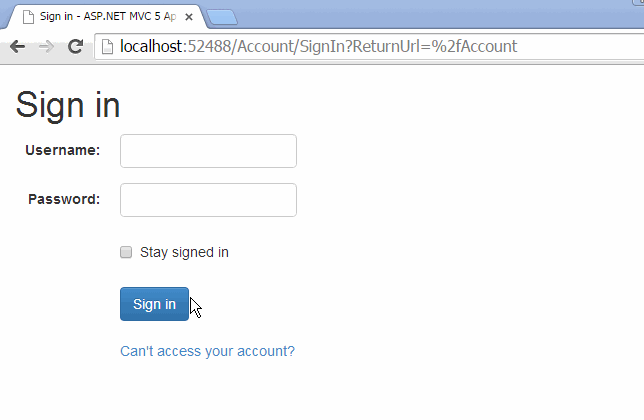

[MvcAccount][1] — Authentication and Account Management plugin for ASP.NET MVC
==============================================================================

> **Note: Development of MvcAccount has ceased. See [NoMVC](http://maxtoroq.github.io/2015/06/nomvc.html).**

MvcAccount is the simplest way to password-protect your ASP.NET MVC application. It consists of a single assembly which includes models, views, controllers, resources, etc. Add a bit of configuration and you are done!

See the [documentation][2] to get started.

Functions
---------
- **Sign In/Out**: With account lock out after max. invalid attempts.
- **Reset Password**: Sends email with link to enter new password.
- **Change Password**: User must sign in first.
- **Change Email**: With optional verification (sends email with link).

Password encryption
-------------------
- **None**: Passwords are stored in clear text.
- **PBKDF2** ([Recommended](http://brockallen.com/2012/10/19/password-management-made-easy-in-asp-net-with-the-crypto-api/)): Passwords are hashed with the RFC 2898 algorithm.
  Implemented by [Crypto](http://msdn.microsoft.com/library/system.web.helpers.crypto), also used by [SimpleMembershipProvider](http://msdn.microsoft.com/library/webmatrix.webdata.simplemembershipprovider).
- **SHA1**: Passwords are encrypted one-way using the SHA1 hashing algorithm (implemented by [SqlMembershipProvider](http://msdn.microsoft.com/library/system.web.security.sqlmembershipprovider)).
- **MachineKey**: Passwords are encrypted using the encryption settings determined by the machineKey element configuration (also implemented by SqlMembershipProvider).
- **Custom**: Provide your own implementation.

Integration
-----------
- **MembershipProvider**: Although MvcAccount is a substitute for MembershipProvider there are many components out there that work against this API, so MvcAccount also provides an implementation. The only functions currently implemented are:
  - **ValidateUser** (useful if your application implements other functions that require username/password verification).
  - **GetUser** (all overloads, this allows you to get user information from your application without a direct dependency on MvcAccount).
- **Bootstrap**: Views use Bootstrap markup and classes (optional, you are not required to use Bootstrap).

Localization
------------
MvcAccount is fully localized in the following languages:

- English (en)
- Spanish (es)
- Finnish (fi)
- Portuguese (pt)

Not included
------------
MvcAccount doesn't provide the following functionality:

- Anything related with roles or claims.
- External login providers (OAuth, OpenID).

[1]: https://github.com/maxtoroq/MvcAccount
[2]: docs/README.md